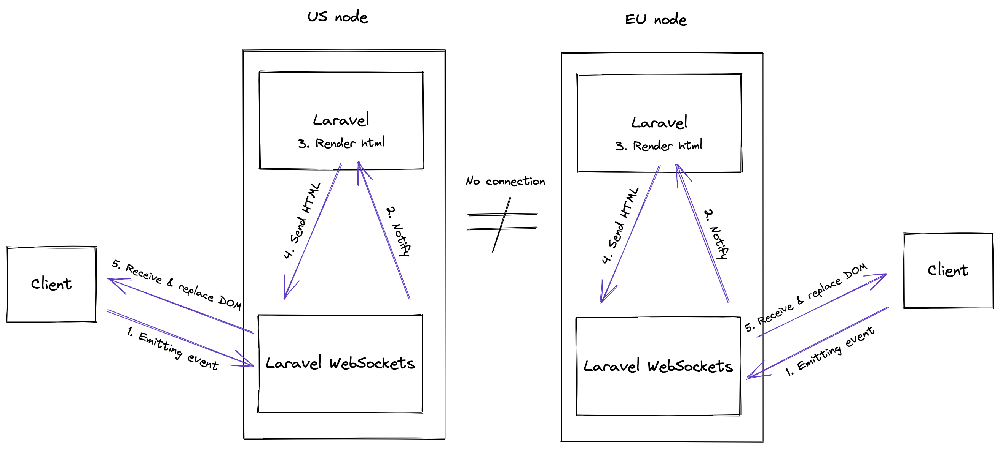
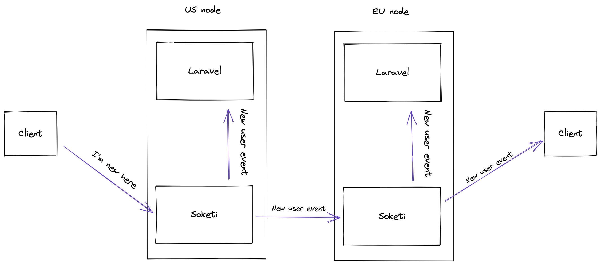
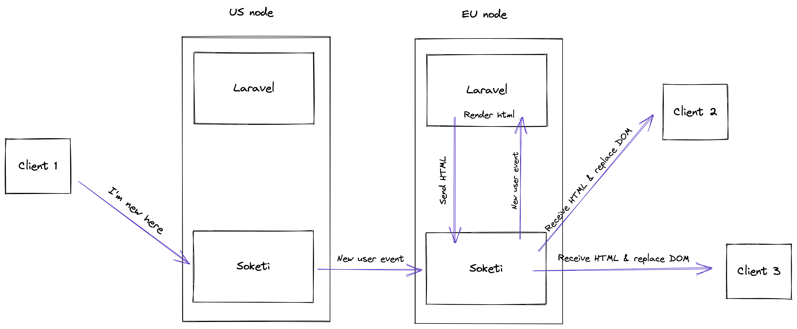

# Livewire websockets concepts

I wanted to have a well-deserved sleep after yesterday's workday, but my mind keep asked questions: "Did I find the right solution? Is there a suitable solution? Am I missing something? Since I'm not a DevOps person, it was tough for me, but it was the right time to ask one of my best friends. Google. After a bunch of searching, things started to get more precise.

First of all, I had to separate two concepts that were the subject of the workday.

## Livewire WebSockets

Mark told this concept that it would be nice if, in the future, we could replace the current HTTP fetch implementation with WebSockets in Laravel Livewire. Things to consider here:

_-_ We need a WebSocket server to handle connections since it is not possible in Laravel out-of-the-box (PHP is not the best language to do such thing...). We can use the famous package called [Laravel Websockets](https://beyondco.de/docs/laravel-websockets/getting-started/introduction)

_-_ We have to change the implementation of sending events and receiving HTML from HTTP to WebSockets in Livewire

_-_ We also need a workaround to use Livewire as an SPA because navigating through pages in Livewire makes full-site reloads, which will always result in closing the WS connection than opening a new one. Possible workarounds could be making a Livewire Router package, which automatically sets URL in JS and displays components based on the current route, or we can make a Livewire Web Worker package that will handle WebSocket connections in a Web Worker preventing the reconnection on every reload.

**__**The biggest question is still how to scale WebSockets horizontally?**__**

Let's assume we have made contributions to Livewire to be able to use WebSockets instead of HTTP requests. Does this kind of use of WebSockets need to be scaled horizontally? I think the answer is no because always the closest Laravel node will render our HTML, and this HTML doesn't have to be distributed to other nodes. Of course, there is this exception; what if our app has some collaborative features? How would that work? Before we dive into that, let's see a chart explaining the Livewire WebSockets concept.

## Distributed WebSockets

The second concept was the "Online Status" feature, which shows who is currently online in the application, just as Slack or Discord do. When somebody is connected or disconnected, a message must be distributed worldwide to every node. In the briefing, Michael mentioned that Phoenix Pub/Sub has this feature, where the nodes connect and can send messages blazingly fast between each other. The magic here is that there isn't a primary server where every message has to arrive to be distributed. When a node receives a message, it sends it forward to all other nodes. But the typical Laravel developer is not familiar with Elixir and Phoenix Pub/Sub (even if it can be somehow hidden), so we have to find a Laravel way to do this.

### [Ratchet](http://socketo.me/)

This package is a PHP WebSocket server implementation. Laravel Websockets use this under the hood. The main problem is that it doesn't provide a horizontal scaling solution. I have seen a few GitHub issues about the topic, but they are all outdated. [One of the developers](https://github.com/ratchetphp/Ratchet/issues/363#issuecomment-168031202) made the horizontal scaling by creating a primary node, and all of the nodes then connected to it using the [PAWL](https://github.com/ratchetphp/Pawl) package. I see the possibility of implementing a horizontal scaling solution to Ratchet, but it would be a lot of work. If we need to go to a native PHP way, this would be that.

### [Laravel Websockets](https://beyondco.de/docs/laravel-websockets/getting-started/introduction)

This package is a Laravel based Websocket server. I have found some info in Github that maybe it is scalable using Redis, but v2 is still in beta and not likely to be released in the foreseeable future.

### [Soketi](https://soketi.app/)

Then I found Soketi, which is a node.js WebSocket server implementation. The creator of the package made many contributions to the Laravel WebSockets package. Also, Soketi is one of the preferred ways for the WebSocket server in the [Laravel docs](https://laravel.com/docs/9.x/releases#soketi-echo-server). It provides [multiple horizontal scaling solutions](https://docs.soketi.app/advanced-usage/horizontal-scaling), using Redis or NATS (Michael talked about that) or even Private Network Cluster. As far as I understand, the last option is similar to how Phoenix Pub/Sub works under the hood. The protocol is decentralized, which means there is no primary node and can work only under the same private network. If I'm right, this is a thing that can be done using Fly.io since all the nodes can communicate with each other. So how would this implementation look without Livewire?

## Merge

So now we have a concept of how Livewire would work with WebSockets, and we have an idea of how WebSockets can be distributed to multiple regions. How to merge these two? Let's see an example.

When a new client connects to the US node, the Soketi server distributes the message to the EU node's Soketi server, sending it to the Laravel backend. It renders the HTML and sends it back to the EU Soketi server; then, it is distributed to all edge clients.

## Fly.io deployment UX

The achieve the results described above, we have to deploy Soketi Servers. There is at least two way to do that. We can make separate Soketi Server nodes and add them to our network. The second option would be to put the Soketi Server into our Laravel Backend node. We have to make a Dockerfile and install node.js and the Soketi server, using [this guide](https://fly.io/docs/app-guides/multiple-processes/), we have to run multiple processes on the Fly.io image. We also have to configure the Soketi Cluster as described [here](https://docs.soketi.app/advanced-usage/horizontal-scaling/clustering).

## Summary

Using distributed WebSockets with Laravel and Livewire is not the most straightforward problem to tackle. Still, if we could have an easy-to-use implementation, this would open many new opportunities for Livewire developers.
